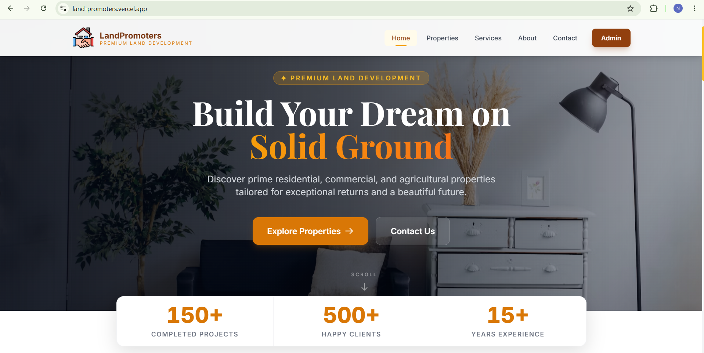
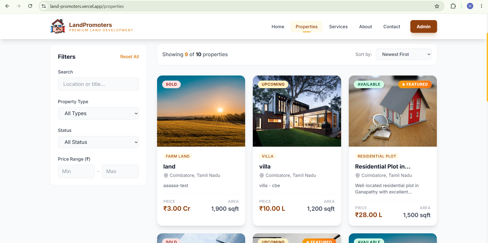
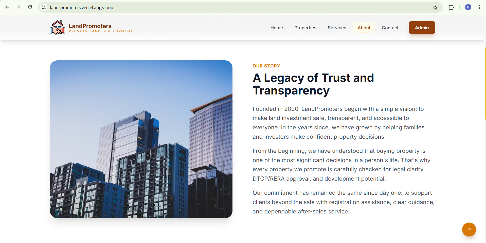
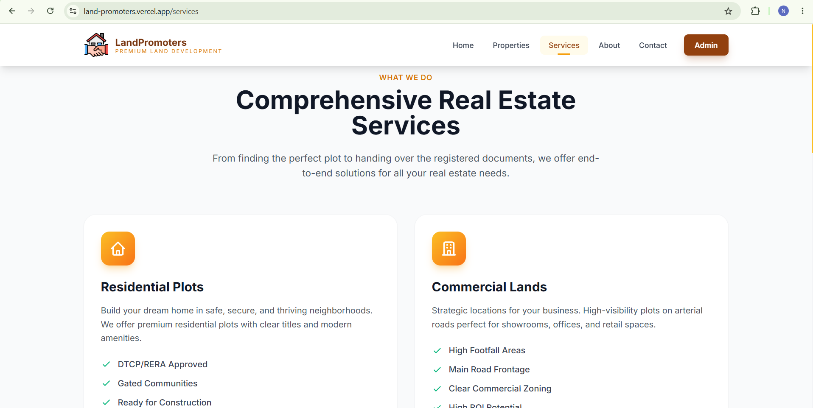
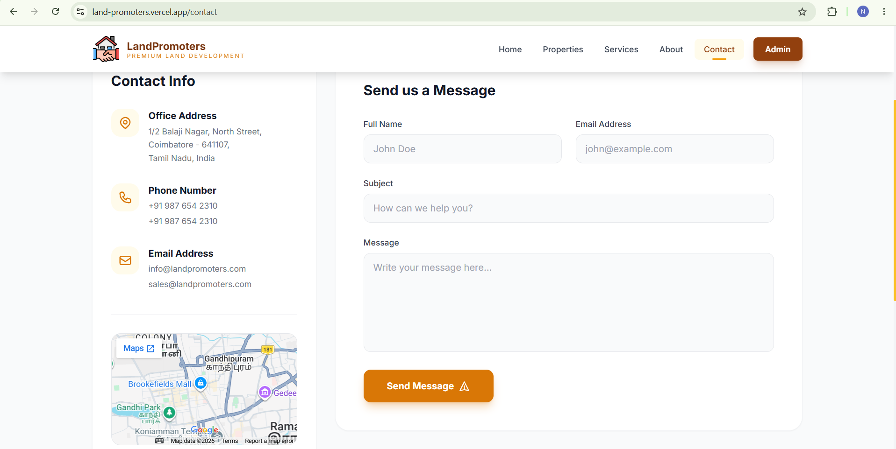
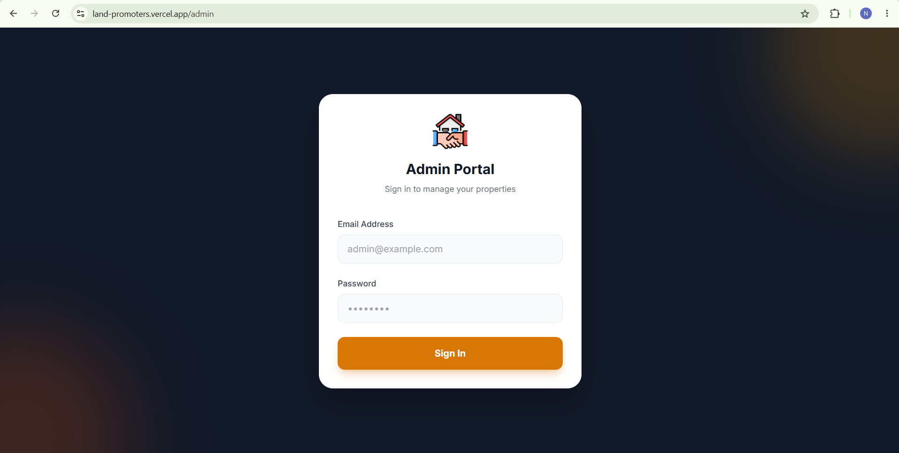

# LandPromoters

[](Frontend/package.json)
[](package.json)
[](package.json)
[](backend/model)
[](Frontend/tailwind.config.js)

### Full-stack real estate platform with a public property catalogue and secure admin dashboard.

LandPromoters is a full-stack real estate platform built for a land development business in Coimbatore, Tamil Nadu. It combines a polished public property website with a secure admin workspace for managing listings, photos, testimonials, contact enquiries, and property status.

## Features

### Public property experience

- Browse residential plots, commercial plots, farm land, villas, and other listings
- Search by keyword and filter by type, status, city, and price range
- Paginated property results with availability badges and formatted Indian currency
- Dedicated property detail pages with image galleries, location information, features, and amenities
- Responsive navigation and layouts for mobile, tablet, and desktop
- Contact form that saves visitor enquiries to the backend

### Admin operations

- JWT-protected admin login and dashboard statistics
- Create, preview, edit, and delete property listings
- Add photos while preserving the existing property gallery
- Manage property status, pricing, location, features, amenities, and featured visibility
- View, read, and delete contact enquiries
- Manage testimonials and approval status
- Confirmation dialogs, loading states, error handling, and toast feedback

### Engineering details

- REST API with Express and Mongoose
- Centralized Axios client with authentication token handling
- Async error middleware and production-aware error responses
- Multer-based property image uploads
- Optional Nodemailer SMTP support for admin replies and notifications

## Deployed App

Open the live application: [land-promoters.vercel.app](https://land-promoters.vercel.app/)

## Screenshots

### Public Website

| Home | Properties | About |
| --- | --- | --- |
|  |  |  |

| Services | Contact |
| --- | --- |
|  |  |

### Admin Dashboard

| Admin login | Property management |
| --- | --- |
|  |  |

## Local Setup

### Requirements

- Node.js 18 or newer
- npm
- MongoDB or a MongoDB Atlas connection string

### Install dependencies

From the project root:

```powershell
npm install
cd Frontend
npm install
cd ..
```

Start the backend from the project root:

```powershell
npm run server
```

In a second terminal, start the frontend:

```powershell
cd Frontend
npm run start
```

Open the local URL printed by Vite, then visit `/admin` to access the admin dashboard.

### Access admin login

```text
Email: admin@landpromoters.local
Password: ChangeMe123!
```

## Why This Project Stands Out

This project goes beyond a brochure website. It models a practical business workflow from discovery to operations:

1. A visitor explores available land and property listings.
2. Search and filters reduce the catalogue to relevant opportunities.
3. A visitor submits an enquiry through the contact experience.
4. The enquiry is persisted and made available to administrators.
5. An administrator reviews, updates, previews, and manages listings from one workspace.

That workflow demonstrates frontend product thinking, REST API integration, authentication, database modelling, file uploads, responsive UI implementation, and deployment-aware configuration.

## Technology Stack

| Layer | Technology |
| --- | --- |
| Frontend | React 18, Vite, React Router, Redux Toolkit, Tailwind CSS |
| Backend | Node.js, Express.js |
| Database | MongoDB with Mongoose |
| Authentication | JWT, bcrypt, protected admin routes |
| File handling | Multer with server-side uploads |
| Email | Nodemailer integration available for SMTP-enabled deployments |
| Deployment | Vercel-ready frontend and Render-ready backend |

## Architecture

```text
Frontend (React + Vite)
        |
        | Axios REST requests
        v
Backend (Express API)
        |
        +--> MongoDB / Mongoose
        +--> JWT authentication
        +--> Multer image uploads
        +--> Optional SMTP notifications and admin replies
```

## Main Routes

### Public website

- `/` — Home page
- `/properties` — Property catalogue
- `/properties/:slug` — Public property details
- `/about` — Company story
- `/services` — Services
- `/contact` — Contact form

### Admin workspace

- `/admin` — Admin login
- `/admin/dashboard` — Overview and statistics
- `/admin/properties` — Property management
- `/admin/properties/:slug` — Admin property preview
- `/admin/properties/:slug/edit` — Edit property details and add photos
- `/admin/messages` — Enquiry management
- `/admin/testimonials` — Testimonial management

## API Overview

The backend is served under `/api/landpromoters`.

| Method | Endpoint | Purpose |
| --- | --- | --- |
| `GET` | `/properties` | Browse and filter properties |
| `GET` | `/properties/:slug` | Get property details |
| `POST` | `/contact-us` | Save a visitor enquiry |
| `POST` | `/admin/login` | Authenticate an administrator |
| `POST` | `/admin/change-password` | Change the administrator password |
| `GET` | `/admin/messages` | List contact enquiries |
| `PATCH` | `/admin/messages/:id` | Mark an enquiry read or unread |
| `DELETE` | `/admin/messages/:id` | Delete an enquiry |
| `POST` | `/admin/messages/:id/reply` | Send an optional email reply |
| `POST` | `/admin/properties` | Create a property |
| `PUT` | `/admin/properties/:id` | Update property details and photos |
| `DELETE` | `/admin/properties/:id` | Delete a property |

## Security Notes

- Keep `backend/config/config.env` out of source control.
- Store MongoDB, JWT, admin, SMTP, and future AI credentials in environment variables.
- Never expose backend secrets in the React frontend.
- Use strong production credentials and rotate them if they are exposed.


## Future Improvements

- Add an AI admin reply assistant that drafts professional responses to contact enquiries for review before sending
- Add AI-powered property recommendations from natural-language requests such as “show residential plots near Coimbatore under ₹30 lakh”
- Add an AI-assisted property description generator for listing copy, highlights, SEO metadata, and social captions
- Add SMTP or a transactional email provider for contact notifications and admin replies
- Add image deletion, gallery ordering, and dedicated object storage for production photos
- Add server-side admin pagination, audit history, role-based permissions, and automated API/browser tests

## Portfolio Summary

**LandPromoters** demonstrates how I approach a real product: understand the business workflow, create a clear user experience, connect it to a maintainable API, secure the operational tools, and support the deployment environment.

Built with React, Node.js, Express, MongoDB, Redux Toolkit, Tailwind CSS, and JWT authentication.